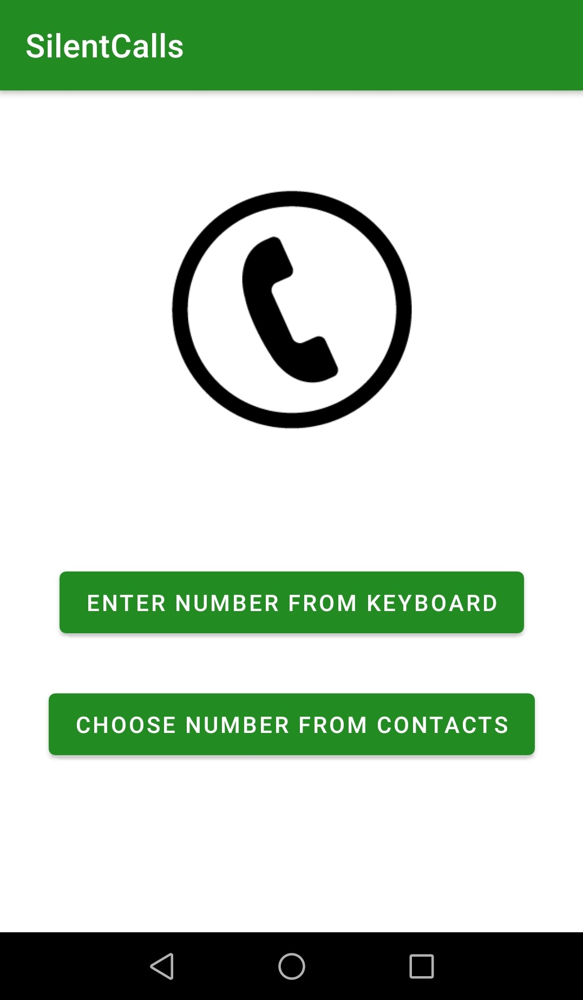

# Silent calls
#### Silent calls is an simple android application that allows you to restrict a number while making a phone call.
### Platform: Android
### Screenshots: 
> * Main page:
> 

> * About page:

> * Choose manual/contacts page

> * Contact list display

> * Enter number page

