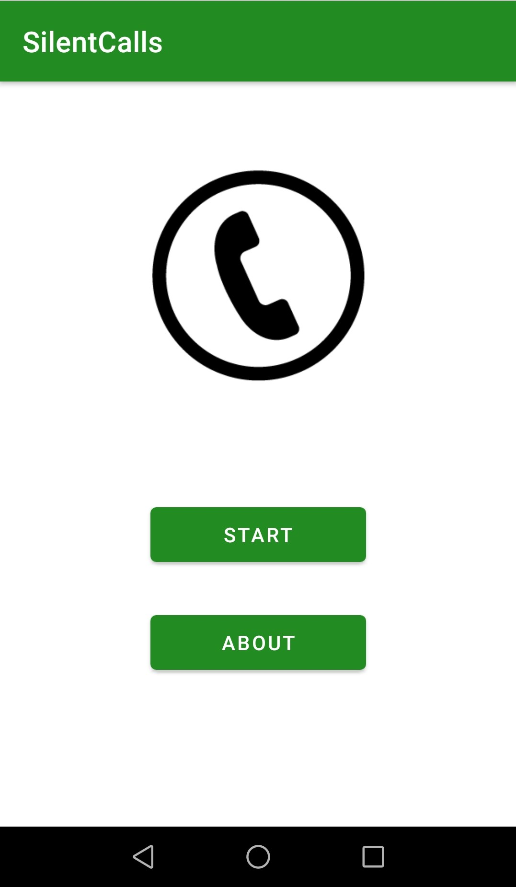
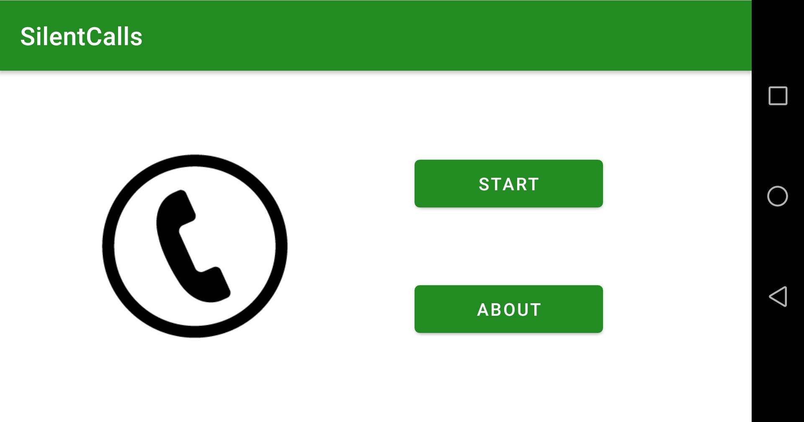
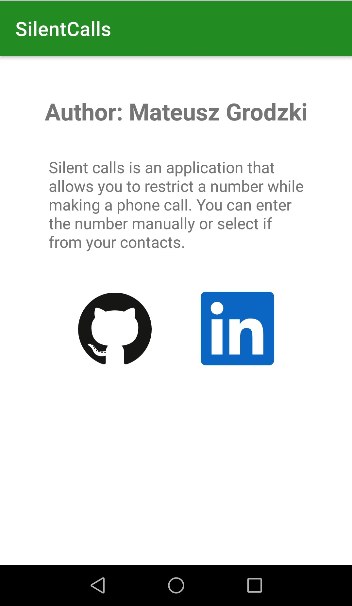
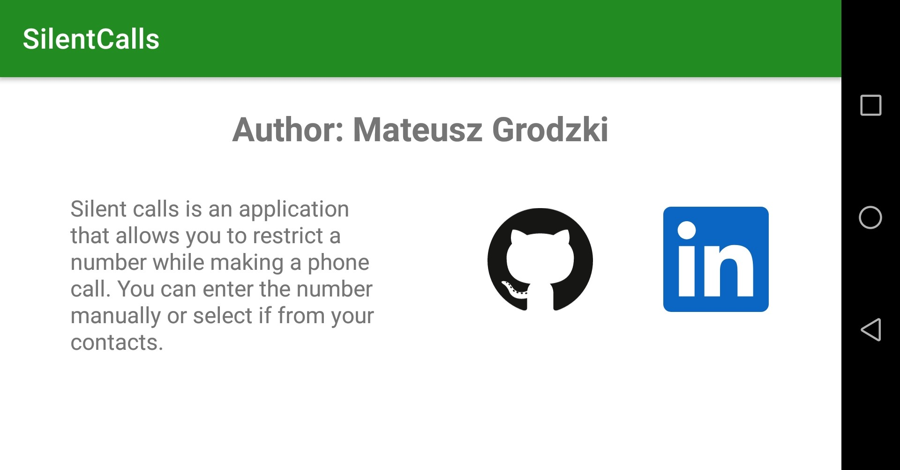
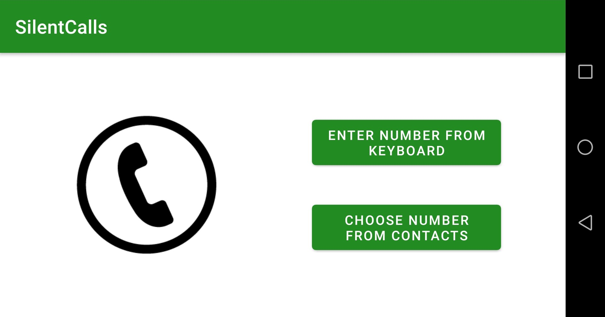
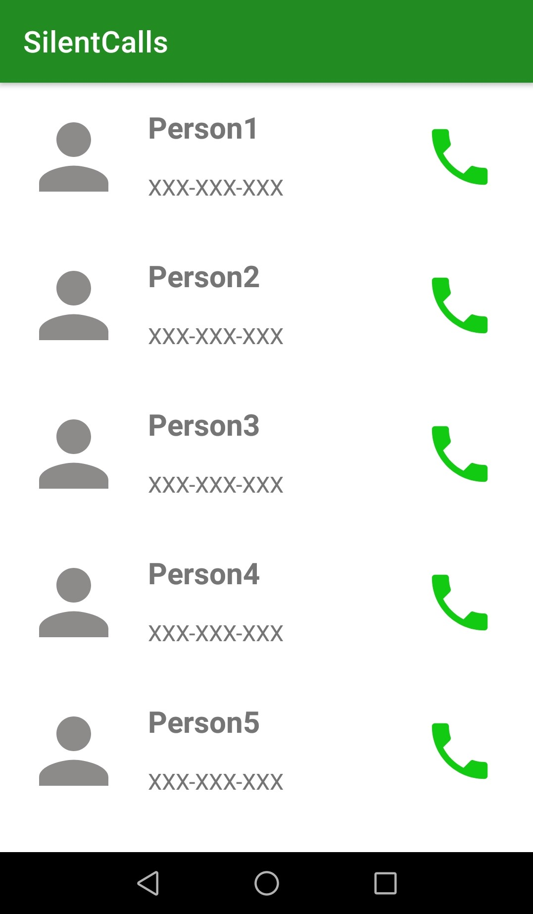
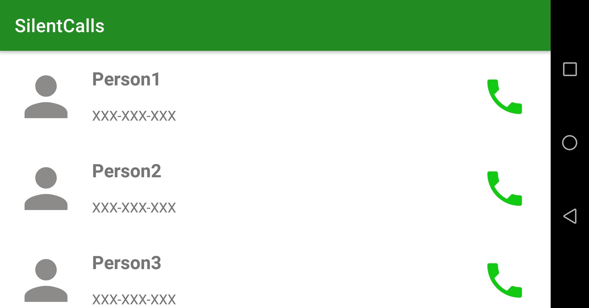
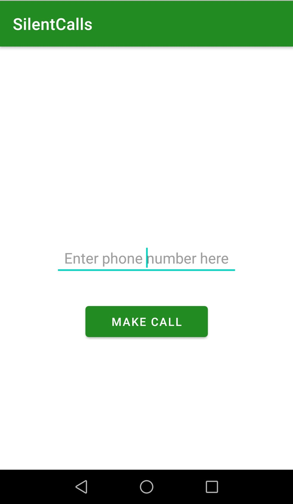
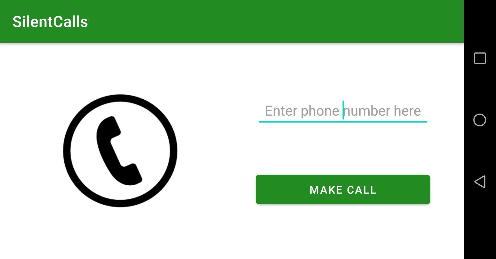

# Silent calls
#### Silent calls is an simple android application that allows you to restrict a number while making a phone call.
### Platform: Android
### Screenshots: 
> * Main page:

  

  

> * About page:

  

  

> * Choose manual/contacts page

  

  

> * Contact list display

  

  

> * Enter number page

  

  

